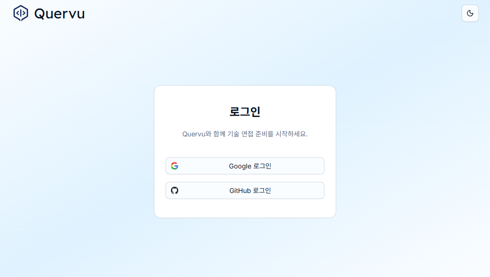
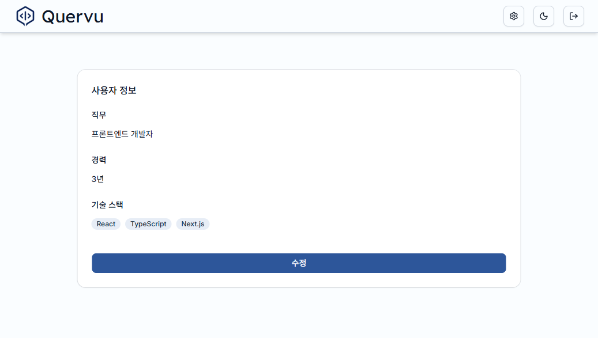
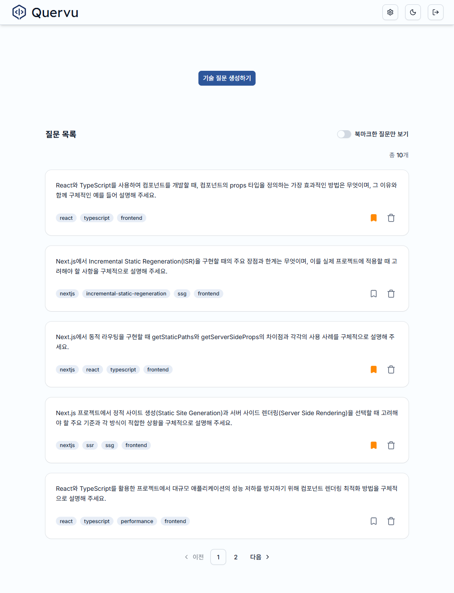
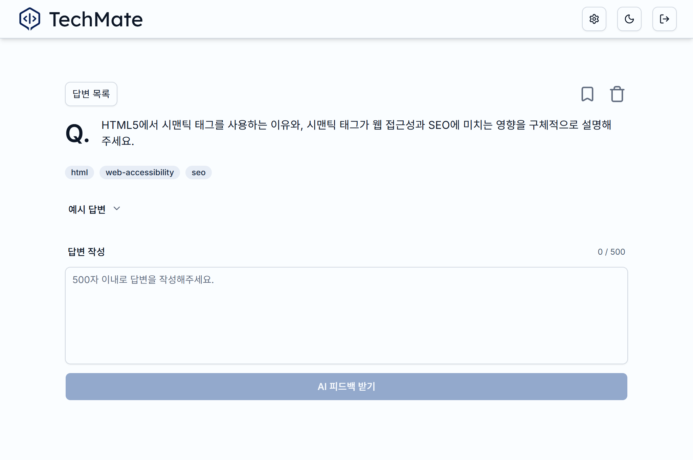
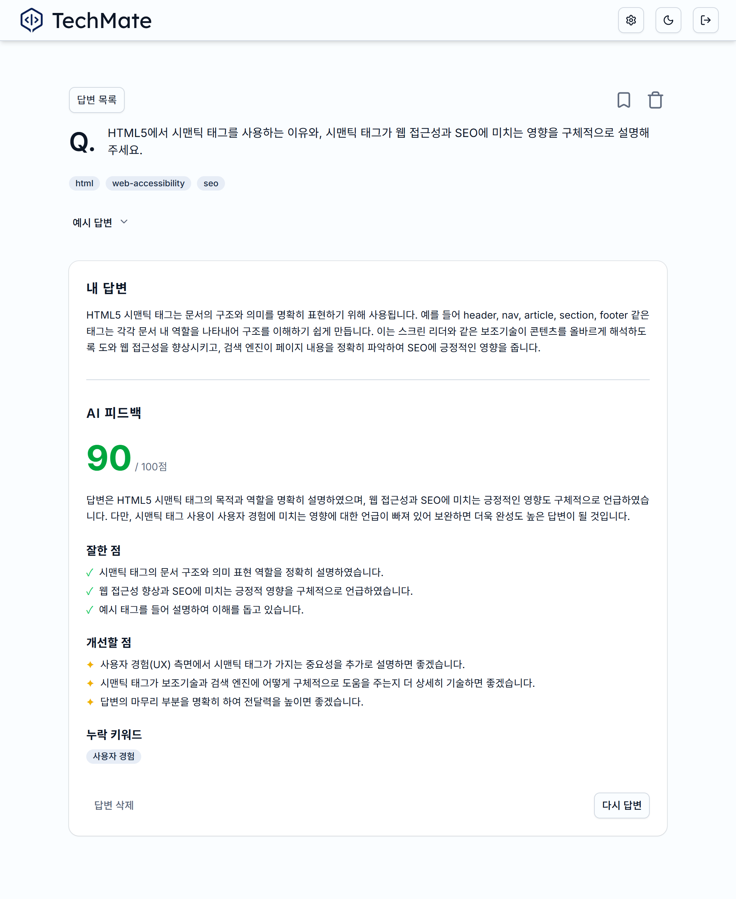
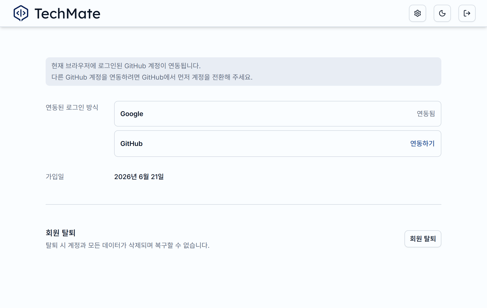
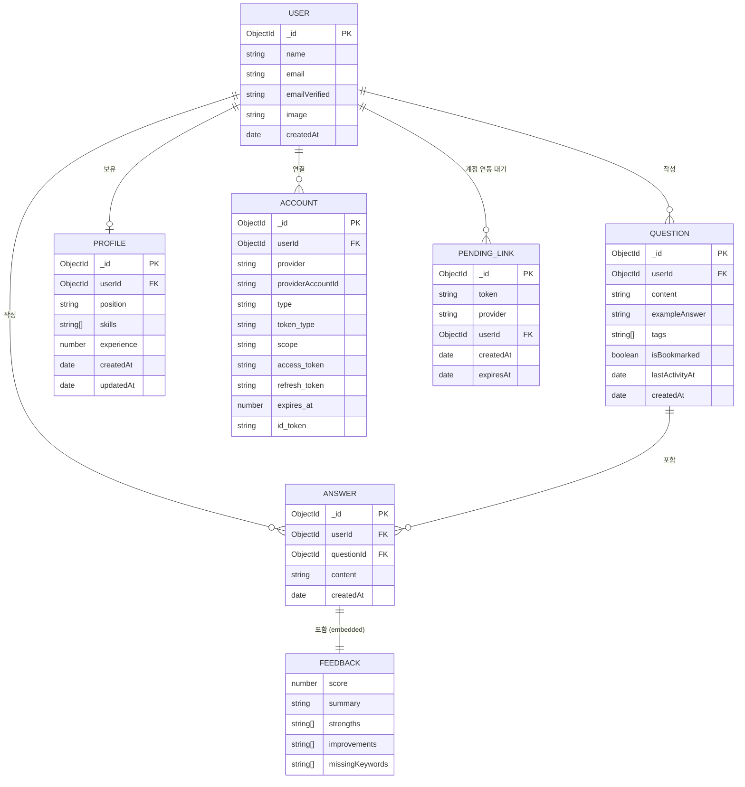

# TechMate

AI 기반 기술 면접 연습 서비스

사용자 프로필을 바탕으로 AI가 면접 질문을 생성하고, 작성한 답변에 대해 피드백을 제공합니다.

**[→ 서비스 바로가기](https://techmate-ai.com)**

<br>


## 기획 의도

기술 면접 준비 과정에서 예상 질문을 여러 곳에서 직접 찾아야 했고, 작성한 답변이 적절한지 스스로 검토해야 했습니다. 이러한 번거로움을 줄이기 위해 질문 생성부터 답변 피드백까지 한 흐름에서 관리할 수 있는 서비스를 만들었습니다.

<br>

## 스크린샷

| 로그인                           | 프로필 설정                             |
| -------------------------------- | --------------------------------------- |
|  |  |

| 홈 화면                          | 질문 페이지                              |
| -------------------------------- | ---------------------------------------- |
|  |  |

| 피드백 페이지                              | 계정 페이지                             |
| ------------------------------------------ | --------------------------------------- |
|  |  |

<br>

## 주요 기능

- **맞춤형 기술 면접 질문 생성** - 직군/연차/기술스택 기반
- **AI 답변 피드백** - 점수(0~100), 강점, 개선점, 누락 키워드 분석
- **프로필 설정** - 직군/연차/기술스택 설정
- **북마크** - 중요한 질문 저장 및 필터링
- **OAuth 로그인** - Google/GitHub 소셜 로그인
- **소셜 계정 연동** - 하나의 계정에 Google/GitHub 계정을 추가 연동

<br>

## 기술 스택

| 분류          | 기술                                                 |
| ------------- | ---------------------------------------------------- |
| Core          | Next.js (App Router), React, TypeScript              |
| UI            | Tailwind CSS v4, Shadcn UI                           |
| 인증          | NextAuth v5, Google OAuth, GitHub OAuth              |
| 데이터베이스  | MongoDB, Mongoose                                    |
| AI            | OpenAI SDK                                           |
| 테스트 & 품질 | Jest, React Testing Library, ESLint, Prettier, Husky |

<br>

## 시작하기

<br>

### 사전 준비

- Node.js 24+
- MongoDB Atlas 또는 로컬 MongoDB
- [Google OAuth 앱](https://console.cloud.google.com/) 등록
- [GitHub OAuth 앱](https://github.com/settings/developers) 등록
- OpenAI API 키

<br>

### 설치

```bash
git clone https://github.com/Yuna-001/techmate.git
cd techmate
npm install
```

<br>

### 환경 변수 설정

`.env.example`을 복사해 `.env.local`을 생성하고 값을 채웁니다.

```bash
cp .env.example .env.local
```

| 변수명               | 설명                                                 |
| -------------------- | ---------------------------------------------------- |
| `AUTH_SECRET`        | NextAuth 세션 암호화 키 (`npx auth secret`으로 생성) |
| `MONGODB_URI`        | MongoDB 연결 문자열                                  |
| `OPENAI_API_KEY`     | OpenAI API 키                                        |
| `AUTH_GOOGLE_ID`     | Google OAuth Client ID                               |
| `AUTH_GOOGLE_SECRET` | Google OAuth Client Secret                           |
| `AUTH_GITHUB_ID`     | GitHub OAuth App Client ID                           |
| `AUTH_GITHUB_SECRET` | GitHub OAuth App Client Secret                       |

<br>

### 개발 서버 실행

```bash
npm run dev
```

브라우저에서 [http://localhost:3000](http://localhost:3000)을 열어 확인합니다.

<br>

## 프로젝트 구조

```
techmate/
├── app/
│   ├── (auth)/          # 로그인 페이지
│   ├── (protected)/     # 인증 필요 페이지 (홈, 질문, 설정)
│   └── api/             # REST API 라우트
├── components/          # React 컴포넌트
├── lib/                 # 유틸리티 (AI 연동, fetch, 포맷, 페이지네이션)
├── models/              # Mongoose 스키마 (Question, Answer, Profile)
└── types/               # TypeScript 타입 정의
```

<br>

## 데이터 모델



<br>

## 스크립트

| 명령어                 | 설명                         |
| ---------------------- | ---------------------------- |
| `npm run dev`          | 개발 서버 실행               |
| `npm run build`        | 프로덕션 빌드                |
| `npm start`            | 프로덕션 서버 실행           |
| `npm test`             | 전체 테스트 실행             |
| `npm run test:changed` | 변경 파일 관련 테스트만 실행 |
| `npm run typecheck`    | TypeScript 타입 검사         |
| `npm run lint`         | ESLint 검사                  |
| `npm run format:check` | Prettier 포맷 검사           |
